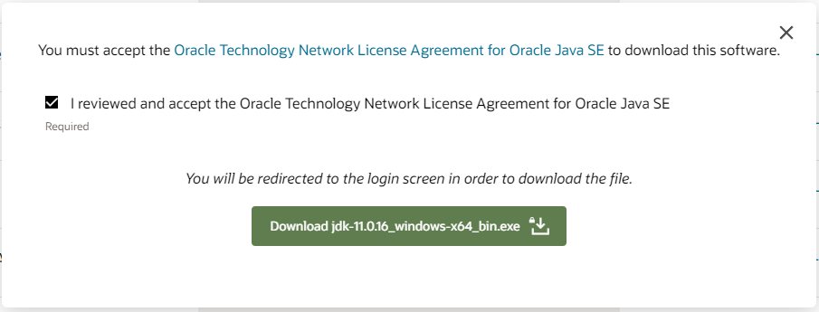

# Installing Git

## 1. Go to https://git-scm.com/

## 2. Navigate to the Dowloads Section

## 3. Choose the version for your system, Windows or MacOS

## 4. WINDOWS - Download the Git Installer

## 4a. MAC - Choose the binary installer

## 4b. MAC - Click the big green `Download` button

## 4c. MAC - Wait for the download to start, once it has completed you can leave the page

## 5. Run the installer (Some steps may be slightly different on Mac, try to emulate the same setting as close as possible)

## 6. Read the License Information then hit `Next`

## 7. On the `Select Components` screen leave this default, and then hit `Next`

## 8. On the `Choosing the default editor used by Git` screen, choose `Use Visual Studio Code as Git's Default editor` from the dropdown menu, then hit `Next`

## 9. On the `Adjusting the name of the initial branch in new repositories` screen, choose the `Override the default branch name for new repositories` option, and use the default name of `main`, hit `Next`

## 10. On the `Adjusting your PATH environment` leave this default and hit `Next`

## 11. On the `Choosing the SSH executable` leave this default and hit `Next`

## 12. On the `Choosing HTTPS transport backent` leave this default and hit `Next`

## 13. On the `Configuring the line ending conversions` leave this default and hit `Next`

## 14. On the `Configuring the terminal emulator to use with Git Bash` leave this default and hit `Next`

## 15. On the `Choose the default behavior of git pull` leave this default and hit `Next`

## 16. On the `Choose a credential helper` leave this default and hit `Next`

## 17. On the `Configuring extra options` leave this default and hit `Next`

## 18. On the `Configuring experimental options` leave this default and hit `Next`

## 19. Hit install

## 20. Hit Finish

# Installing Java

## 1. Oracle JDK Site

https://www.oracle.com/java/technologies/javase/jdk11-archive-downloads.html

## 2 MAC. Choose the correct .dmg for your mac

## 2 WINDOWS. Choose the windows installer

## 3. After Choosing your installation method, you will be greeted with a checkbox to have you login or create an account

## 4. Click on the Download jdk-11.0.16 and it will redirect you to you login page. Choose create account.

## 5. Fill out the information with your name and email, put Revature as the company

## 6. Click create account to continue with the download, you will have to verify your email

## 7. After successfully registering, and confirming you email, navigate back to the Oracle login page and enter your newly created account information to start the download

## 8. After downloading, click the installer to start

## 9. On the welcome screen hit `Next`

## 10. Leave the installation in the default folder and hit `Next`

## 11. Choose `Close`

## 12a. WINDOWS: Search for `Environment Variables` in the lower left search bar

### Choose the option for `Edit system environment variables`

### Inside of the `System Properties` window choose the `Environment variables` button

### Under `User variables for "your account name"` choose the `New` button to create a variable called `JAVA_HOME`

### `Variable name:` should be JAVA_HOME and the `Variable value:` should be the location of the java bin folder

### Click the `OK` button

### Below in the `System Variables` section, select the `Path` variable and click the `Edit` button

### Click the `New` button and paste the same folder location as the `JAVA_HOME` variable from before

### Click `OK`, then click `OK` again, then finally close out of the `System Properties` window with a final OK

## 12b. MAC: Please follow these directions on properly setting up your Environment variables

https://mkyong.com/java/how-to-set-java_home-environment-variable-on-mac-os-x/

## 13. Check to be sure Java 11 is properly installed by opening a git bash terminal and running `java -version`

## 14. Download `Eclipse Enterprise Edition` for your specific machine from https://www.eclipse.org/downloads/packages/release/kepler/sr2/eclipse-ide-java-ee-developers

## 15. Follow the installation steps, they are straight forward

## 16. Download `VSCode` for your specific machine from https://code.visualstudio.com/download

## 17. Follow the installation steps, they are straight forward

## 18. Download `Postman` for your specific machine from https://code.visualstudio.com/download

